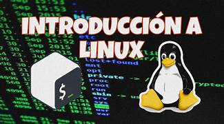

# Capítulo 1: Introducción a Linux y el Entorno de Trabajo
## Objetivos
Al finalizar la práctica, serás capaz que es la:

1.1 Identificación del Sistema: Capacidad de extraer datos técnicos clave (distribución, kernel y arquitectura) mediante comandos de terminal.

1.2 Exploración de Software Libre: Identificar y diferenciar los tipos de licencias (GPL, BSD, MIT) de los programas instalados en el sistema.

1.3 Navegación por la Ayuda: Dominar el uso de manuales internos (man, info, --help) para resolver dudas técnicas sin soporte externo.

1.4 Gestión del Shell e Historial: Optimizar la productividad mediante el uso de variables de entorno, autocompletado y recuperación de comandos previos.

1.5 Terminales Virtuales (TTY): Comprender la arquitectura multiusuario de Linux y la navegación entre consolas de texto y entorno gráfico.
<br/><br/>

## Tiempo estimado
- 75 minutos.
<br/><br/>

## Objetivo visual 


<br/><br/>

## Tabla de Ayuda

## Comandos de Identificación y Sistema

| Categoría | Comando | Acción Principal | Ejemplo de Uso |
| :--- | :--- | :--- | :--- |
| **Kernel** | `uname` | Ver versión del núcleo y arquitectura (`-a`). | `uname -r` |
| **Distribución**| `cat` | Consultar el archivo de identidad del sistema. | `cat /etc/os-release` |
| **Hardware** | `hostnamectl` | Resumen de nombre de host, SO y arquitectura. | `hostnamectl` |
| **Tiempo** | `uptime` | Saber cuánto tiempo lleva encendido el servidor. | `uptime` |
| **Usuarios** | `who` / `w` | Ver quién está conectado y qué está haciendo. | `w` |
| **Terminal** | `tty` | Identificar en qué terminal (consola) estás. | `tty` |
| **Limpieza** | `clear` | Limpiar la pantalla de la terminal. | `clear` |

## Herramientas de Ayuda y Documentación

En Linux, la documentación está integrada. Estas herramientas son esenciales para el autoaprendizaje.

| Herramienta | Función | Ejemplo |
| :--- | :--- | :--- |
| `--help` | Ayuda rápida y resumen de sintaxis del comando. | `mkdir --help` |
| `man` | Manual oficial completo (páginas de manual). | `man ls` |
| `info` | Documentación detallada con hipervínculos. | `info coreutils` |
| `whatis` | Descripción de una sola línea del comando. | `whatis rm` |
| `apropos` | Buscar comandos por palabra clave o función. | `apropos "copy"` |

---

## Atajos de Productividad del Shell (Bash)

El Shell no es solo para escribir; tiene funciones que ahorran minutos de trabajo repetitivo.

### Teclas de Acceso Rápido:
* **Tabulador (Tab)**: **Autocompletado**. Escribe el inicio de un comando o ruta y presiona Tab para que el sistema lo termine por ti.
* **Ctrl + R**: **Búsqueda inversa**. Escribe una palabra para encontrar un comando que usaste en el pasado.
* **Flecha Arriba/Abajo**: Navegar por el historial de comandos recientes.
* **Ctrl + C**: Cancelar o detener el proceso que se está ejecutando actualmente.
* **Ctrl + L**: Equivalente al comando `clear` (limpia la pantalla).

### Gestión del Historial y Alias:
* `history` -> Muestra la lista numerada de tus últimos comandos.
* `!n` -> Ejecuta el comando número "n" del historial.
* `alias nombre='comando'` -> Crea un apodo para un comando largo.
    * *Ejemplo:* `alias actualizar='sudo apt update'`
<br/><br/>

## Instrucciones 
<br/><br/>
## Laboratorio 1.1: Identificación y Exploración del Sistema

- **Objetivo**: Identificar la distribución, versión del kernel, arquitectura y tiempo de encendido del sistema.
- **Tiempo estimado**: 15 a 20 minutos.
- **Comandos relacionados**: `uname`, `cat`, `uptime`, `hostnamectl`, `clear`.

### Desarrollo paso a paso:

1.  **Limpiar el entorno**:
    ```bash
    clear
    ```
2.  **Identificar la Distribución**:
    ```bash
    cat /etc/os-release
    ```
    *Busque las líneas `PRETTY_NAME`, `ID` y `VERSION`.*
3.  **Consultar el Kernel y la Arquitectura**:
    * `uname -s` (Nombre del kernel)
    * `uname -r` (Versión exacta)
    * `uname -m` (Arquitectura, ej: x86_64)
    * `uname -a` (Todo lo anterior)
4.  **Resumen del Sistema con hostnamectl**:
    ```bash
    hostnamectl
    ```
5.  **Verificar la Disponibilidad (Uptime)**:
    ```bash
    uptime
    ```
6.  **Explorar la versión según el proceso**:
    ```bash
    cat /proc/version
    ```

---

## Laboratorio 1.2: Exploración de Licencias y Software Libre

- **Objetivo**: Identificar licencias (GPL, BSD, MIT) y comprender la diferencia entre Software Libre y Código Abierto.
- **Tiempo estimado**: 20 a 25 minutos.
- **Comandos relacionados**: `dpkg` / `rpm`, `ls`, `grep`, `less`.

### Desarrollo paso a paso:

1.  **Localizar el repositorio de licencias**:
    ```bash
    ls /usr/share/common-licenses/
    ```
2.  **Identificar la licencia de un comando esencial (Bash)**:
    * **Debian/Ubuntu**: `cat /usr/share/doc/bash/copyright | less`
    * **RHEL/Fedora**: `rpm -qi bash | grep License`
3.  **Investigar una herramienta de red (curl)**:
    ```bash
    cat /usr/share/doc/curl/copyright | head -n 20
    ```
4.  **Listar licencias de múltiples paquetes**:
    * **Debian/Ubuntu**: `dpkg-query -W -f='${Package}: ${Maintainer}\n' | head -n 15`
    * **RHEL/Fedora**: `rpm -qa --queryformat '%{NAME}: %{LICENSE}\n' | head -n 15`
5.  **Concepto de "Copyleft" vs "Permisivas"**: Explorar `/usr/share/doc/` buscando archivos de `copyright` en paquetes como `openssh-client` para compararlos con la GPL.

---

## Laboratorio 1.3: Navegación por la Ayuda (Man, Info y Help)

- **Objetivo**: Consultar documentación técnica oficial y diferenciar las fuentes de ayuda interna.
- **Tiempo estimado**: 15 a 20 minutos.
- **Comandos relacionados**: `man`, `info`, `--help`, `whatis`, `apropos`.

### Desarrollo paso a paso:

1.  **Búsqueda por palabras clave**:
    ```bash
    apropos "copy files"
    ```
2.  **Uso de la ayuda rápida**:
    ```bash
    mkdir --help
    ```
3.  **Exploración profunda con man**:
    ```bash
    man ls
    ```
    *Dentro del manual: usa `/` para buscar texto (ej. `/human-readable`) y `q` para salir.*
4.  **Navegación avanzada con info**:
    ```bash
    info coreutils 'ls invocation'
    ```
5.  **Definiciones rápidas**:
    ```bash
    whatis rm
    ```

---

## Laboratorio 1.4: Exploración del Shell y Gestión del Historial

- **Objetivo**: Identificar el shell activo, usar variables de entorno y dominar el historial de comandos.
- **Tiempo estimado**: 15 a 20 minutos.
- **Comandos relacionados**: `echo`, `history`, `env`, `alias`.

### Desarrollo paso a paso:

1.  **Identificar el Shell activo**:
    ```bash
    echo $SHELL
    ```
2.  **Uso del Autocompletado**: Escribe `hostn` y presiona la tecla `Tab`.
3.  **Gestión del Historial**:
    ```bash
    history
    ```
    *Ejecuta un comando anterior usando `!n` (donde n es el número en la lista).*
4.  **Búsqueda inversa**: Presiona `Ctrl + R` y empieza a escribir un comando usado anteriormente (ej. `uname`).
5.  **Creación de un Alias temporal**:
    ```bash
    alias ll='ls -lah'
    ll
    ```

---

## Laboratorio 1.5: Interfaz de Usuario y Terminales Virtuales (TTY)

- **Objetivo**: Comprender el concepto de TTY, conmutar entre consolas virtuales y gestionar sesiones multiusuario.
- **Tiempo estimado**: 15 a 20 minutos.
- **Comandos relacionados**: `tty`, `who`, `w`.

### Desarrollo paso a paso:

1.  **Identificar la terminal actual**:
    ```bash
    tty
    ```
2.  **Ver quién está conectado**:
    ```bash
    w
    ```
3.  **Cambiar a una Terminal Virtual (Modo Texto)**: Presiona `Ctrl + Alt + F3` (F3 a F6 suelen ser consolas de texto).
4.  **Iniciar sesión en la TTY**: Introduce tu usuario y contraseña. Luego verifica con `tty` que estás en `/dev/tty3`.
5.  **Regresar al Entorno Gráfico**: Presiona `Ctrl + Alt + F2` o `Ctrl + Alt + F1` (dependiendo de la distribución).

**Resumen**: Si el entorno gráfico falla, las TTY permiten recuperar el control del sistema.

