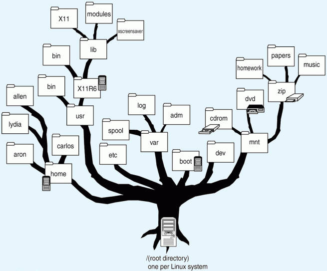

# Capítulo 2: El Sistema de Archivos en Linux
## Objetivos
Al finalizar la práctica, serás capaz de manejar la:

2.1 Exploración de la Jerarquía (FHS): Comprender la organización estándar del árbol de directorios de Linux para localizar archivos de configuración, ejecutables y logs.

2.2 Manipulación y Comodines: Dominar la creación de estructuras complejas y la gestión masiva de archivos mediante caracteres especiales (*, ?, []).

2.3 Búsqueda Eficiente: Diferenciar y aplicar el uso de locate para búsquedas indexadas rápidas y find para filtrados técnicos avanzados.

2.4 Rutas y Navegación: Perfeccionar el desplazamiento por el sistema mediante el uso experto de rutas absolutas, relativas y atajos de teclado.

2.5 Enlaces e Inodos: Entender la estructura física del disco mediante la creación y diagnóstico de enlaces duros (Hard Links) y simbólicos (Soft Links).

## Tiempo estimado
- 100 minutos.
<br/><br/>

## Objetivo visual 


<br/><br/>

## Tabla de Ayuda

Durante esta práctica...

| Nº | Comando                                               | Descripción                                                                                |Ejemplo de uso               |
| 1  | | | |
<br/><br/>

## Instrucciones 
<br/><br/>

## Laboratorio 2.1: Exploración de la Jerarquía del Sistema (FHS)

- **Objetivo**: Comprender la organización estándar (FHS), identificando dónde se guardan programas, configuraciones y datos.
- **Tiempo estimado**: 20 a 25 minutos.
- **Comandos relacionados**: `cd`, `ls -F`, `pwd`, `file`.

### Desarrollo paso a paso:

1.  **Ubicación Inicial y Salto al Raíz**:
    ```bash
    cd /
    ls -F
    ```
    *Resultado esperado: Verás carpetas como `bin/`, `etc/`, `home/`. El símbolo `/` es el origen de todo.*

2.  **Diferenciar Binarios de Usuario y de Sistema**:
    ```bash
    ls /bin | head
    ls /sbin | head
    ```
    *Resultado esperado: En `/bin` verás comandos comunes (`ls`, `cp`). En `/sbin` comandos de administración (`fdisk`, `reboot`).*

3.  **El Almacén de Configuraciones (/etc)**:
    ```bash
    cd /etc
    ls -d *.conf
    ```

4.  **Identificar tipos de archivos con file**:
    ```bash
    file /bin/ls
    file /etc/passwd
    ```
    *Resultado esperado: El primero es un ejecutable ELF y el segundo es texto ASCII, sin importar que no tengan extensión.*

5.  **Archivos Variables y Temporales**:
    * Explora `/var/log` para ver registros del sistema.
    * Explora `/tmp` para archivos volátiles.

6.  **El Directorio Personal (~)**:
    ```bash
    cd ~
    pwd
    ```

**Resumen Mental**:
* `/etc`: Configuración.
* `/bin` / `/usr/bin`: Programas.
* `/var`: Datos que cambian (logs).
* `/home`: Archivos personales.

---

## Laboratorio 2.2: Manipulación de Archivos y Uso de Comodines

- **Objetivo**: Crear estructuras de directorios y gestionar archivos masivamente usando comodines.
- **Tiempo estimado**: 25 a 30 minutos.
- **Comandos relacionados**: `mkdir`, `touch`, `cp`, `mv`, `rm`.

### Desarrollo paso a paso:

1.  **Crear una estructura de proyecto**:
    ```bash
    mkdir -p proyecto/{datos,scripts,backups}
    ```

2.  **Generación masiva de archivos**:
    ```bash
    touch proyecto/datos/archivo{1..10}.txt
    touch proyecto/datos/nota_{a,b,c}.log
    ```

3.  **Copia selectiva con el comodín `*`**:
    ```bash
    cp proyecto/datos/*.txt proyecto/backups/
    ```

4.  **Movimiento preciso con el comodín `?`**:
    ```bash
    mkdir proyecto/datos/un_digito
    mv proyecto/datos/archivo?.txt proyecto/datos/un_digito/
    ```
    *(Mueve del 1 al 9, pero no el 10).*

5.  **Uso de rangos `[]` y borrado**:
    ```bash
    rm proyecto/datos/nota_[ab].log
    ```

6.  **Renombrar directorios**:
    ```bash
    mv proyecto/backups proyecto/respaldos_finales
    ```

---

## Laboratorio 2.3: Búsqueda Eficiente de Archivos (Find y Locate)

- **Objetivo**: Localizar archivos mediante base de datos (`locate`) y en tiempo real (`find`).
- **Tiempo estimado**: 20 a 25 minutos.
- **Comandos relacionados**: `find`, `locate`, `updatedb`, `which`.

### Desarrollo paso a paso:

1.  **Búsqueda instantánea con locate**:
    ```bash
    locate passwd
    ```
2.  **Actualizar la base de datos**:
    ```bash
    sudo updatedb
    ```
3.  **Búsqueda en tiempo real por nombre**:
    ```bash
    find /etc -name "*.conf"
    ```
4.  **Búsqueda por tiempo de modificación** (últimos 10 min):
    ```bash
    find /etc -mmin -10
    ```
5.  **Búsqueda por tamaño** (mayores a 50MB):
    ```bash
    find /var -size +50M
    ```
6.  **Localizar binarios**:
    ```bash
    which ls
    whereis ls
    ```

---

## Laboratorio 2.4: Atajos de Navegación y Rutas

- **Objetivo**: Diferenciar rutas absolutas de relativas y dominar atajos (`.`, `..`, `~`, `-`).
- **Tiempo estimado**: 15 a 20 minutos.

### Desarrollo paso a paso:

1.  **Ruta Absoluta** (desde la raíz):
    ```bash
    cd /etc/network
    pwd
    ```
2.  **Ruta Relativa** (desde donde estás):
    * Si estás en `/etc`, ejecuta: `cd ssh`.
3.  **Subir niveles**:
    ```bash
    cd ..
    cd ../../
    ```
4.  **El atajo del Hogar**: `cd ~` o simplemente `cd`.
5.  **El Salto Atrás**:
    ```bash
    cd -
    ```
    *(Vuelve a la carpeta anterior donde estabas parado).*

---

## Laboratorio 2.5: Enlaces Físicos (Hard Links) y Simbólicos (Soft Links)

- **Objetivo**: Diferenciar enlaces y comprender el papel del Inodo.
- **Tiempo estimado**: 20 a 25 minutos.
- **Comandos relacionados**: `ln`, `ls -i`, `stat`.


### Desarrollo paso a paso:

1.  **Preparación**:
    ```bash
    mkdir ~/lab_enlaces && cd ~/lab_enlaces
    echo "Contenido original" > archivoA.txt
    ```

2.  **Creación de enlaces**:
    * **Físico**: `ln archivoA.txt enlace_fisico`
    * **Simbólico**: `ln -s archivoA.txt enlace_simbolico`

3.  **Análisis de Inodos**:
    ```bash
    ls -li
    ```
    *Observación: El archivo original y el físico comparten el mismo número de Inodo.*

4.  **Prueba de persistencia**:
    ```bash
    rm archivoA.txt
    cat enlace_fisico    # Funciona
    cat enlace_simbolico # Error (roto)
    ```

### Resumen de Enlaces

| Característica | Enlace Físico (Hard Link) | Enlace Simbólico (Soft Link) |
| :--- | :--- | :--- |
| **Inodo** | Comparte el mismo inodo. | Tiene su propio inodo único. |
| **Cruzar Particiones** | No permitido. | Permitido. |
| **Si borras original** | El dato sigue accesible. | El enlace queda roto. |
| **Directorios** | No permitido. | Permitido. |

---
**Desafío Extra**: Intenta crear un enlace físico a un directorio con `ln`. Observa el error del sistema y compáralo creando uno simbólico con `ln -s`.
