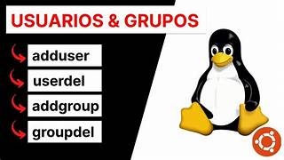

# Laboratorio 3: Crear usuarios y configurar permisos en archivos y directorios
## Objetivos
Al finalizar la práctica, serás capaz de conocer los siguientes conceptos:


3.1 Gestión de Cuentas: Aprender a administrar el ciclo de vida de usuarios y grupos (creación, modificación y eliminación) en el sistema.

3.2 Permisos de Archivos (chmod): Dominar el control de acceso mediante las nomenclaturas octal y simbólica para definir quién puede leer, escribir o ejecutar.

3.3 Propiedad de Archivos (chown): Entender la transferencia de pertenencia de archivos y directorios entre diferentes usuarios y grupos de trabajo.

3.4 Permisos Especiales (SUID/SGID/Sticky): Configurar entornos de colaboración avanzados y seguros mediante bits de permisos especiales del kernel.

3.5 Elevación de Privilegios (sudo): Implementar la delegación controlada de tareas administrativas mediante la configuración del archivo sudoers.
<br/><br/>

## Tiempo estimado
- 70 minutos.
<br/><br/>

## Objetivo visual 


<br/><br/>

## Tabla de Gestión de Usuarios y Grupos

| Categoría | Comando | Acción Principal | Ejemplo de Uso |
| :--- | :--- | :--- | :--- |
| **Cuentas** | `useradd` | Crear un nuevo usuario en el sistema. | `sudo useradd -m usuario1` |
| **Modificación** | `usermod` | Cambiar propiedades (ej. añadir a un grupo). | `sudo usermod -aG sudo usuario1` |
| **Eliminación** | `userdel` | Borrar usuario (con `-r` borra su /home). | `sudo userdel -r usuario1` |
| **Grupos** | `groupadd` | Crear un nuevo grupo de trabajo. | `sudo groupadd docentes` |
| **Grupos** | `groups` | Ver los grupos a los que pertenece un usuario. | `groups usuario1` |
| **Seguridad** | `passwd` | Cambiar o establecer contraseña. | `sudo passwd usuario1` |
| **Identidad** | `id` | Ver UID, GID y grupos del usuario. | `id usuario1` |

## Gestión de Permisos y Propiedad

| Categoría | Comando | Acción Principal | Ejemplo de Uso |
| :--- | :--- | :--- | :--- |
| **Permisos** | `chmod` | Cambiar permisos de lectura, escritura y ejecución. | `chmod 755 script.sh` |
| **Propiedad** | `chown` | Cambiar el dueño y el grupo del archivo. | `sudo chown root:root log.txt` |
| **Privilegios** | `sudo` | Ejecutar un comando con nivel de superusuario. | `sudo apt update` |
| **Configuración** | `visudo` | Editar `/etc/sudoers` para delegar permisos. | `sudo visudo` |

---

## Cálculo de Permisos (Octal)

Los permisos en Linux se calculan sumando los valores de cada acción para el **Dueño**, el **Grupo** y **Otros**.

### Valores de referencia:
* **4**: Lectura (`r`)
* **2**: Escritura (`w`)
* **1**: Ejecución (`x`)
* **0**: Sin permisos (`-`)

### Combinaciones comunes:
* **7** (4+2+1): **Control Total** (rwx).
* **6** (4+2): **Lectura y Escritura** (rw-).
* **5** (4+1): **Lectura y Ejecución** (r-x).
* **4**: **Solo Lectura** (r--).

**Ejemplo de estructura:**
`chmod 644 archivo.txt`
1.  **6** (Dueño): Lee y Escribe.
2.  **4** (Grupo): Solo Lee.
3.  **4** (Otros): Solo Lee.
<br/><br/>

## Instrucciones 
<br/><br/>

## Laboratorio 3.1: Creación de Cuentas y Grupos

- **Objetivo**: Aprender a gestionar el ciclo de vida de usuarios y grupos desde la línea de comandos.
- **Tiempo estimado**: 15 minutos.
- **Comandos relacionados**: `groupadd`, `useradd`, `usermod`, `id`, `grep`.

### Desarrollo paso a paso:

1.  **Crear el grupo colaborativo**:
    ```bash
    sudo groupadd proyecto_it
    ```

2.  **Crear tres usuarios nuevos** (`user1`, `user2`, `user3`) asignándoles el grupo secundario en un solo paso:
    ```bash
    sudo useradd -m -G proyecto_it user1
    sudo useradd -m -G proyecto_it user2
    sudo useradd -m -G proyecto_it user3
    ```
    *Nota: `-m` crea el home y `-G` asigna el grupo suplementario.*

3.  **Asignar contraseñas** (opcional para pruebas de login):
    ```bash
    sudo passwd user1
    ```
    *(Repetir para los demás).*

4.  **Verificación**:
    ```bash
    id user1
    ```
    **Resultado esperado**: El comando debe mostrar el UID del usuario y confirmar que pertenece al GID de `proyecto_it`.

---

## Laboratorio 3.2: Permisos Octales y Simbólicos

- **Objetivo**: Dominar las dos nomenclaturas de `chmod` para asegurar scripts.
- **Tiempo estimado**: 10 minutos.
- **Comandos relacionados**: `chmod`, `ls -l`, `touch`. 
- **Asegurate de estar en tu directorio de casa** `cd`, `pwd`

### Desarrollo paso a paso:

1.  **Preparar el archivo**:
    ```bash
    cd
    touch script_test.sh
    ```

2.  **Método Simbólico**: Configurar: Dueño (ejecución), Grupo (lectura), Otros (nada).
    ```bash
    chmod u=x,g=r,o= script_test.sh
    ```
    *Verificar con `ls -l` resultando en `--x r-- ---`.*

3.  **Método Octal**: Aplicar la misma restricción (740 para dueño total, lectura grupo).
    ```bash
    chmod 740 script_test.sh
    ```

4.  **Verificación**:
    ```bash
    ls -l script_test.sh
    ```
    **Resultado esperado**: La salida debe ser `-rwxr-----`. El dueño puede leer/escribir/ejecutar, el grupo solo leer.

---

## Laboratorio 3.3: Colaboración en Directorios (Permisos Especiales)

- **Objetivo**: Configurar un entorno de trabajo compartido seguro.
- **Tiempo estimado**: 20 minutos.
- **Comandos relacionados**: `mkdir`, `chgrp`, `chmod`.

### Desarrollo paso a paso:

1.  **Crear el directorio de trabajo**:
    ```bash
    sudo mkdir /opt/shared_it
    ```

2.  **Cambiar el grupo propietario** al grupo del proyecto:
    ```bash
    sudo chgrp proyecto_it /opt/shared_it
    ```

3.  **Configurar permisos de colaboración**:
    ```bash
    sudo chmod 770 /opt/shared_it
    ```
    *(Dueño y Grupo: todo; Otros: nada).*

4.  **Aplicar el SGID (Bit especial)**:
    ```bash
    sudo chmod g+s /opt/shared_it
    ```
    *Esto asegura que todo archivo nuevo creado dentro pertenezca automáticamente al grupo `proyecto_it`.*

**Resultado esperado**: Al crear un archivo dentro como `user1`, el grupo del archivo será `proyecto_it` y no el grupo primario del usuario.

---

## Laboratorio 3.4: Cambio de Propiedad

- **Objetivo**: Transferir la responsabilidad de archivos entre cuentas.
- **Tiempo estimado**: 10 minutos.
- **Comandos relacionados**: `chown`, `chgrp`, `sudo`.

### Desarrollo paso a paso:

1.  **Crear un archivo como root**:
    ```bash
    sudo touch /tmp/reporte_admin.txt
    ```

2.  **Transferir la propiedad al usuario regular**:
    ```bash
    sudo chown user1 /tmp/reporte_admin.txt
    ```

3.  **Cambiar el grupo específicamente**:
    ```bash
    sudo chgrp proyecto_it /tmp/reporte_admin.txt
    ```

4.  **Verificación**:
    ```bash
    ls -l /tmp/reporte_admin.txt
    ```
    **Resultado esperado**: La tercera y cuarta columna de la salida de `ls` deben mostrar `user1 proyecto_it`.

---

## Laboratorio 3.5: Elevación de Privilegios (Sudoers)

- **Objetivo**: Delegar poder administrativo limitado (Principio de menor privilegio).
- **Tiempo estimado**: 15 minutos.
- **Comandos relacionados**: `visudo`, `sudo`, `whoami`.

### Desarrollo paso a paso:

1.  **Abrir el editor de sudoers de forma segura**:
    ```bash
    sudo visudo
    ```

2.  **Añadir la regla para `user1`** (permitirle reiniciar servicios sin ser root total). Al final del archivo, agregar:
    ```text
    user1 ALL=(ALL) /usr/bin/systemctl restart cron
    ```

3.  **Probar el comando como `user1`**:
    ```bash
    sudo su - user1
    sudo systemctl restart cron
    sudo cat /etc/shadow
    ```

**Resultado esperado**: El sistema permitirá a `user1` ejecutar esa línea específica, pero si intenta `sudo cat /etc/shadow`, recibirá un mensaje de "permiso denegado".
