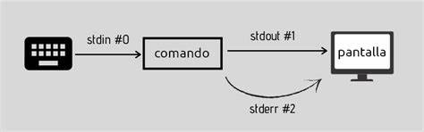

# Laboratorio 4: Construir pipelines y usar filtros para extraer datos
## Objetivos
Al finalizar la práctica, serás capaz de manejar:

4.1 Tuberías (Pipes): Aprender a encadenar comandos independientes para crear flujos de procesamiento de datos en tiempo real mediante el operador.

4.2 Redirección de Salida: Dominar el uso de los operadores > y >> para capturar resultados de comandos y almacenarlos en archivos físicos.

4.3 Gestión de Errores (stderr): Entender la separación de flujos de datos mediante descriptores de archivo para desviar mensajes de error a archivos de registro específicos.

4.4 Edición con Vim: Desarrollar la destreza necesaria para navegar, editar, buscar y guardar configuraciones utilizando los diferentes modos del editor estándar de Linux.

4.5 Procesamiento de Texto: Aplicar filtros avanzados (cut, sort, uniq, wc) para extraer y organizar información específica de archivos de texto y bases de datos del sistema
<br/><br/>

## Tiempo estimado
- 80 minutos.
<br/><br/>

## Objetivo visual 


<br/><br/>

## Tabla de Ayuda

## Comandos de Procesamiento y Texto

| Categoría | Comando | Acción Principal | Ejemplo de Uso |
| :--- | :--- | :--- | :--- |
| **Filtro** | `grep` | Buscar texto específico dentro de un archivo o salida. | `ps aux\|grep user1` |
| **Columnas** | `cut` | Extraer columnas o campos de un texto. | `cut -d: -f1 /etc/passwd` |
| **Orden** | `sort` | Ordenar líneas de texto alfabética o numéricamente. | `cat lista.txt \| sort` |
| **Únicos** | `uniq` | Eliminar o reportar líneas duplicadas adyacentes. | `sort lista.txt \| uniq` |
| **Contador** | `wc` | Contar líneas (`-l`), palabras (`-w`) o caracteres (`-m`). | `wc -l /etc/hosts` |
| **Visualizar** | `cat` | Mostrar el contenido completo de un archivo. | `cat /etc/hostname` |
| **Finales** | `tail` | Ver las últimas líneas de un archivo (útil para logs). | `tail -f /var/log/syslog` |

## Operadores de Redirección y Tuberías

Los operadores permiten controlar hacia dónde fluye la información de los comandos.

| Operador | Nombre | Función | Ejemplo |
| :--- | :--- | :--- | :--- |
| `>` | Redirección Simple | Crea un archivo o **sobrescribe** el existente. | `ls > lista.txt` |
| `>>` | Redirección Append | **Añade** contenido al final del archivo sin borrarlo. | `date >> log.txt` |
| `2>` | Redirección Error | Captura solo los mensajes de **error**. | `cat secreto 2> error.log` |
| `\|` | Tubería (Pipe) | Envía la salida de un comando como **entrada** de otro. | `cat file | grep "error"` |
| `/dev/null` | Agujero Negro | Dispositivo especial para **descartar** datos. | `comando > /dev/null 2>&1` |

---

## Comandos Básicos de Supervivencia en Vim

Vim es un editor modal. Para realizar cualquier acción, debes estar en el modo correcto.

### Modos Principales:
* **Modo Comando (Esc)**: Modo por defecto para navegar y borrar.
* **Modo Inserción (i)**: Para escribir texto.
* **Modo Ex (:)**: Para guardar y salir.

### Atajos Esenciales:
* `:w` -> Guardar (Write).
* `:q` -> Salir (Quit).
* `:wq` -> Guardar y salir.
* `:q!` -> Salir sin guardar (¡Pánico!).
* `/texto` -> Buscar "texto" hacia adelante.
* `dd` -> Borrar una línea completa.
* `u` -> Deshacer el último cambio.
<br/><br/>

## Instrucciones 
<br/><br/>
## Laboratorio 4.1: Tuberías (Pipes)

- **Objetivo**: Combinar comandos independientes para procesar datos en tiempo real.
- **Tiempo estimado**: 10 minutos.
- **Comandos relacionados**: `ps`, `grep`, `|`.

### Desarrollo paso a paso:

1.  **Listar procesos**: Ejecutar el comando para ver la cantidad masiva de datos que genera el sistema.
    ```bash
    ps aux
    ```

2.  **Filtrar por usuario**: Conectar la salida a `grep` para buscar solo los procesos del usuario `user1`.
    ```bash
    ps aux | grep user1
    ```

3.  **Refinamiento**: Filtrar procesos pero excluir la propia línea del comando `grep` para una salida más limpia.
    ```bash
    ps aux | grep user1 | grep -v grep
    ```

**Resultado esperado**: Una lista limpia que solo muestra los procesos ejecutados por el usuario específico.

---

## Laboratorio 4.2: Redirección de Salida (> y >>)

- **Objetivo**: Aprender a capturar la salida de los comandos en archivos físicos.
- **Tiempo estimado**: 10 minutos.
- **Comandos relacionados**: `ls`, `date`, `cat`.

### Desarrollo paso a paso:

1.  **Sobrescribir archivo**: Guardar el contenido del directorio `/etc` en un archivo nuevo.
    ```bash
    ls /etc > lista_etc.txt
    ```

2.  **Añadir información (Append)**: Sin borrar el contenido anterior, agregar una estampa de tiempo al final del mismo archivo.
    ```bash
    date >> lista_etc.txt
    ```

3.  **Verificación**: Leer las últimas líneas del archivo para confirmar ambos pasos.
    ```bash
    tail -n 5 lista_etc.txt
    ```

**Resultado esperado**: El archivo contiene la lista de archivos de `/etc` y, en la última línea, la fecha y hora actual de la ejecución.

---

## Laboratorio 4.3: Redirección de Errores (File Descriptors)

- **Objetivo**: Gestionar de forma separada la salida estándar (*stdout*) y el error estándar (*stderr*).
- **Tiempo estimado**: 15 minutos.
- **Comandos relacionados**: `find`, `cat`, `2>`, `>`.

### Desarrollo paso a paso:

1.  **Forzar un error**: Intentar leer un archivo protegido siendo un usuario normal para generar un mensaje de error.
    ```bash
    cat /etc/shadow
    ```
    *(Verás el mensaje "Permiso denegado").*

2.  **Redirigir el error**: Enviar el error a un log y "descartar" la salida normal enviándola al dispositivo nulo.
    ```bash
    cat /etc/shadow > /dev/null 2> errores.log
    ```

3.  **Verificación**: Comprobar que la terminal quedó limpia y el archivo registró el incidente.
    ```bash
    cat errores.log
    ```

**Resultado esperado**: La terminal no muestra salida, pero el archivo `errores.log` contiene el texto: `cat: /etc/shadow: Permiso denegado`.

---

## Laboratorio 4.4: Editor Vi/Vim (Modos de operación)

- **Objetivo**: Sobrevivir y dominar las funciones básicas del editor estándar de Linux.
- **Tiempo estimado**: 25 minutos.
- **Recursos**: Editor `vim` instalado.

### Desarrollo paso a paso:

1.  **Crear y entrar**: Abrir un archivo nuevo.
    ```bash
    vim configuracion.conf
    ```

2.  **Modo Inserción**: Presionar la tecla `i`, escribir `Puerto=8080` y `Protocolo=TCP`. Luego, presionar `ESC` para volver al modo comando.

3.  **Búsqueda**: Escribir `/Puerto` y presionar `Enter` para saltar directamente a esa palabra dentro del texto.

4.  **Guardar y Salir**: Escribir `:wq` y presionar `Enter`.

5.  **Práctica de pánico**: Entrar de nuevo, borrar todo el contenido con el comando `dG` y salir **sin guardar** los cambios con `:q!`.

**Resultado esperado**: Capacidad para editar archivos de configuración de forma fluida sin bloquearse en el editor.

---

## Laboratorio 4.5: Procesamiento de Texto (Filtros)

- **Objetivo**: Extraer información específica de "bases de datos" de texto del sistema.
- **Tiempo estimado**: 20 minutos.
- **Comandos relacionados**: `cut`, `sort`, `uniq`, `wc`.

### Desarrollo paso a paso:

1.  **Extraer la primera columna**: El archivo `/etc/passwd` usa el carácter `:` como delimitador. Extraemos solo los nombres.
    ```bash
    cut -d: -f1 /etc/passwd
    ```

2.  **Ordenar alfabéticamente**: Pasar la salida anterior a través de un filtro de ordenación.
    ```bash
    cut -d: -f1 /etc/passwd | sort
    ```

3.  **Contar y limpiar**: Contar cuántos usuarios totales hay registrados en el sistema mediante el contador de líneas.
    ```bash
    cut -d: -f1 /etc/passwd | sort | wc -l
    ```

**Resultado esperado**: Una lista organizada de la A a la Z con todos los nombres de usuario del sistema y el conteo final de registros.
