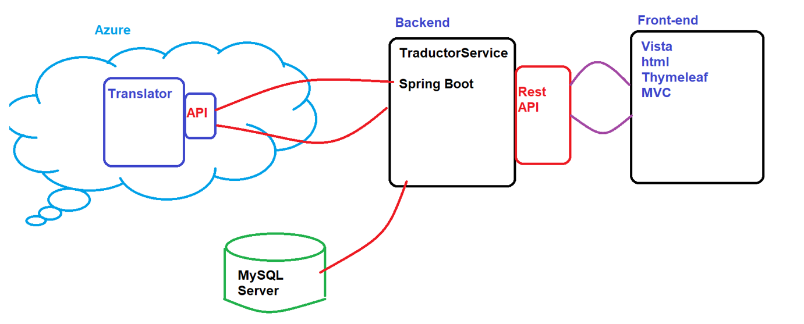

# Capítulo 5: Sistema Operativo Linux
## Objetivos
Al finalizar la práctica, serás capaz de:

5.1 Monitoreo de Procesos: Identificar el consumo de recursos en tiempo real y gestionar el ciclo de vida de los programas mediante el envío de señales (SIGTERM, SIGKILL).

5.2 Auditoría de Logs (Journaling): Navegar y filtrar los registros del sistema con journalctl para diagnosticar fallos críticos y eventos del kernel.

5.3 Gestión de Recursos (Memoria/Disco): Interpretar estadísticas de hardware mediante free y df para prevenir caídas por saturación de almacenamiento o memoria RAM.

5.4 Archivado y Compresión: Dominar el empaquetado de archivos con tar y su posterior compresión para optimizar el espacio y facilitar las copias de seguridad.

5.5 Automatización de Tareas (Cron): Programar la ejecución automática de scripts y comandos recurrentes mediante el demonio crontab.
<br/><br/>

## Tiempo estimado
- 80 minutos.
<br/><br/>

## Objetivo visual 

La imagen muestra...

<br/><br/>

## Tabla de Ayuda

Durante esta práctica...

| Nº | Comando                                               | Descripción                                                                                |Ejemplo de uso               |
| 1  | | | |
<br/><br/>

## Instrucciones 
<br/><br/>
## Laboratorio 5.1: Monitoreo de Procesos (Señales)

- **Objetivo**: Identificar procesos costosos y aprender a finalizarlos de forma controlada o forzada.
- **Tiempo estimado**: 15 minutos.
- **Comandos relacionados**: `top`, `htop`, `kill`, `pkill`.

### Desarrollo paso a paso:

1.  **Ejecución de monitor**: Abrir `top` (o `htop` si está instalado).
2.  **Identificación**: Presionar `M` (en top) para ordenar por uso de Memoria o `P` para CPU. Identificar el PID (Process ID) del proceso con mayor consumo.
3.  **Simulación de proceso**: En otra terminal, ejecutar un comando infinito en segundo plano:
    ```bash
    sleep 1000 &
    ```
4.  **Envío de señal SIGTERM (15)**: Intentar cerrar el proceso de forma amable:
    ```bash
    kill -15 [PID_del_sleep]
    ```
5.  **Envío de señal SIGKILL (9)**: Si un proceso no responde, forzar el cierre inmediato:
    ```bash
    kill -9 [PID]
    ```

**Resultado esperado**: El alumno debe observar cómo el proceso desaparece de la lista de `top` tras enviar la señal correspondiente.

---

## Laboratorio 5.2: Verificación de Logs (Journaling)

- **Objetivo**: Navegar por los registros del sistema para auditoría y resolución de problemas.
- **Tiempo estimado**: 15 minutos.
- **Comandos relacionados**: `journalctl`, `tail`, `less`.

### Desarrollo paso a paso:

1.  **Lectura de logs en tiempo real**: Ejecutar el siguiente comando y observar cómo se generan eventos en vivo:
    ```bash
    tail -f /var/log/syslog
    ```
    *(O `/var/log/messages` en distribuciones basadas en RHEL).*
2.  **Filtrado por arranque**: Usar `journalctl` para ver solo los mensajes desde el último inicio del sistema:
    ```bash
    journalctl -b
    ```
3.  **Filtrado por prioridad**: Ver únicamente los errores críticos registrados:
    ```bash
    journalctl -p err
    ```

**Resultado esperado**: El alumno identificará servicios que fallaron durante el arranque o advertencias emitidas por el kernel.

---

## Laboratorio 5.3: Uso de Memoria y Disco

- **Objetivo**: Interpretar estadísticas de hardware para prevenir caídas por falta de recursos.
- **Tiempo estimado**: 10 minutos.
- **Comandos relacionados**: `free`, `df`, `du`.

### Desarrollo paso a paso:

1.  **Estado de Memoria**: Ejecutar el siguiente comando y analizar la columna "available" vs "free". Identificar si se está haciendo uso de la partición SWAP:
    ```bash
    free -h
    ```
2.  **Estado de Discos**: Ver el porcentaje de ocupación de las particiones montadas:
    ```bash
    df -h
    ```
3.  **Localización de archivos pesados**: Usar `du` para identificar qué carpetas dentro de `/var` consumen más espacio:
    ```bash
    sudo du -sh /var/* | sort -h
    ```

**Resultado esperado**: Comprensión de la diferencia entre memoria física y virtual, y la ocupación de bloques en disco.

---

## Laboratorio 5.4: Compresión y Archivado (Backups)

- **Objetivo**: Empaquetar y comprimir datos respetando los permisos de los archivos.
- **Tiempo estimado**: 20 minutos.
- **Comandos relacionados**: `tar`, `gzip`, `ls -lh`.

### Desarrollo paso a paso:

1.  **Crear el archivo tar (archivar)**:
    ```bash
    sudo tar -cvf backup_etc.tar /etc
    ```
2.  **Comprimir con gzip**:
    ```bash
    gzip backup_etc.tar
    ```
3.  **Verificación de reducción de tamaño**: Comparar el tamaño de la carpeta original con el archivo resultante:
    ```bash
    ls -lh backup_etc.tar.gz
    ```
4.  **Listar contenido sin extraer**: Verificar qué archivos hay dentro del comprimido:
    ```bash
    tar -tvf backup_etc.tar.gz
    ```

**Resultado esperado**: Un único archivo comprimido (`.tar.gz`) que contiene de forma segura la configuración del sistema.

---

## Laboratorio 5.5: Programación de Tareas (Crontab)

- **Objetivo**: Automatizar procesos repetitivos mediante el demonio `cron`.
- **Tiempo estimado**: 20 minutos.
- **Comandos relacionados**: `crontab -e`, `crontab -l`, `tail`.

### Desarrollo paso a paso:

1.  **Abrir el editor de tareas**:
    ```bash
    crontab -e
    ```
2.  **Programar la tarea**: Añadir la siguiente línea al final del archivo (cada 5 minutos):
    ```text
    */5 * * * * echo "Sistema Activo - $(date)" >> /tmp/monitor.log
    ```
    *(Explicación de campos: Minuto, Hora, Día, Mes, Día de la semana).*
3.  **Verificación**: Esperar al ciclo de ejecución y revisar el archivo de log:
    ```bash
    cat /tmp/monitor.log
    ```

**Resultado esperado**: El archivo `/tmp/monitor.log` se actualizará automáticamente con la frase y la fecha cada 5 minutos.

---

## Resumen de comandos para el examen LPIC-1 (Cap 5)

| Categoría | Comando |
| :--- | :--- |
| **Procesos** | `top`, `kill`, `ps`, `uptime` |
| **Recursos** | `free`, `df`, `du`, `iostat` |
| **Compresión** | `tar`, `gzip`, `bzip2`, `xz` |
| **Automatización** | `crontab`, `at` |
