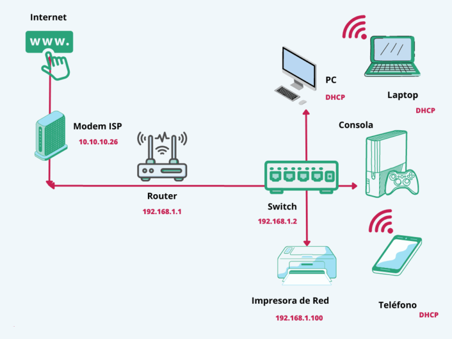

# Laboratorio 7: Diagnóstico y configuraciones básicas
## Objetivos
Al finalizar la práctica, serás capaz de:

7.1 Configuración de Interfaz: Identificar las tarjetas de red físicas y lógicas, y comprender la asignación de direccionamiento IPv4 y máscaras de subred.

7.2 Pruebas de Conectividad: Diagnosticar la comunicación en la red local y externa utilizando herramientas de rastreo de rutas y latencia.

7.3 Resolución de Nombres (DNS): Comprender la jerarquía de traducción de dominios a IP mediante el análisis de archivos de configuración y consultas a servidores externos.

7.4 Puertos y Servicios: Auditar los sockets activos del sistema para identificar qué procesos están escuchando conexiones entrantes y asegurar el servidor.

7.5 Transferencia de Archivos: Dominar el movimiento de datos entre hosts mediante protocolos cifrados y seguros (SCP y SFTP).
<br/><br/>

## Tiempo estimado
- 75 minutos.
<br/><br/>

## Objetivo visual 


<br/><br/>

## Tabla de Ayuda

## Configuración de Interfaces y Direccionamiento

En las distribuciones modernas, el comando `ip` ha sustituido al antiguo `ifconfig`. Es fundamental conocer la sintaxis actual.

| Acción | Comando Moderno (ip) | Comando Clásico |
| :--- | :--- | :--- |
| **Ver IPs y Estado** | `ip addr show` | `ifconfig` |
| **Activar Interfaz** | `sudo ip link set eth0 up` | `ifconfig eth0 up` |
| **Desactivar Interfaz**| `sudo ip link set eth0 down` | `ifconfig eth0 down` |
| **Ver Tabla de Rutas** | `ip route show` | `route -n` / `netstat -rn` |
| **Ver Vecinos (ARP)** | `ip neighbor` | `arp -n` |
---

## Herramientas de Diagnóstico y Pruebas

Estas herramientas permiten verificar si el tráfico fluye correctamente hacia el exterior.

| Herramienta | Función | Ejemplo de Uso |
| :--- | :--- | :--- |
| **ping** | Verificar latencia y conectividad básica. | `ping -c 4 google.com` |
| **traceroute** | Rastrear el camino (saltos) hacia un destino. | `traceroute 8.8.8.8` |
| **dig** | Consultar registros DNS detallados. | `dig linux.org` |
| **host** | Resolución rápida de Nombre a IP y viceversa. | `host google.com` |
| **nmcli** | Gestionar conexiones en sistemas con NetworkManager.| `nmcli device status` |
---

## Puertos, Sockets y Servicios Escuchando

Para la seguridad del servidor, es crítico saber qué programas están abriendo puertos hacia la red.

| Comando | Acción Principal | Parámetros Sugeridos |
| :--- | :--- | :--- |
| **ss** | Ver estadísticas de sockets (sustituye a netstat). | `ss -tulpn` |
| **netstat** | Ver conexiones de red y puertos abiertos. | `netstat -pant` |
| **lsof** | Listar archivos (y puertos) abiertos por procesos. | `sudo lsof -i :80` |
| **nmap** | Escáner de seguridad y puertos (externo). | `nmap localhost` |
---

## Transferencia de Archivos y Acceso Remoto

Protocolos seguros para mover datos entre servidores sin exponer contraseñas en texto plano.

| Herramienta | Función | Sintaxis Básica |
| :--- | :--- | :--- |
| **ssh** | Acceso remoto seguro a la terminal. | `ssh usuario@servidor` |
| **scp** | Copia segura de archivos entre hosts. | `scp archivo.txt user@host:/ruta/` |
| **sftp** | Protocolo de transferencia de archivos sobre SSH. | `sftp usuario@servidor` |
| **wget** | Descargar archivos directamente desde la web. | `wget https://sitio.com/file.zip` |
| **curl** | Transferir datos desde/hacia un servidor (API/Web). | `curl -I google.com` |
<br/><br/>

## Instrucciones 
<br/><br/>
## Laboratorio 7.1: Configuración de Interfaz

- **Objetivo**: Identificar las interfaces de red físicas y lógicas, y entender la asignación de direccionamiento IP.
- **Tiempo estimado**: 10 minutos.
- **Comandos relacionados**: `ip addr`, `ip link`, `nmcli`.

### Desarrollo paso a paso:

1.  **Listar interfaces**: Ejecutar el comando para visualizar todas las tarjetas de red detectadas.
    ```bash
    ip addr show
    ```
2.  **Identificación**: Localizar la interfaz de bucle invertido (`lo`) y la interfaz principal (usualmente nombres como `eth0`, `ens33` o `enp0s3`).
3.  **Análisis de datos**: Anotar la siguiente información de la interfaz activa:
    * **Dirección IPv4**: Marcada como `inet`.
    * **Máscara de subred**: En formato CIDR (ej. `/24`).
    * **Dirección MAC**: Marcada como `link/ether`.

**Resultado esperado**: El alumno debe identificar claramente su IP privada actual y confirmar que el estado de la interfaz es `UP`.

---

## Laboratorio 7.2: Pruebas de Conectividad

- **Objetivo**: Diagnosticar la comunicación en la red local y hacia el exterior.
- **Tiempo estimado**: 15 minutos.
- **Comandos relacionados**: `ping`, `traceroute`, `ip route`.

### Desarrollo paso a paso:

1.  **Identificar la Puerta de Enlace (Gateway)**: Averiguar a qué IP se envían los paquetes para salir de la red local.
    ```bash
    ip route | grep default
    ```
2.  **Prueba local**: Verificar la salud del enlace con el router o gateway.
    ```bash
    ping -c 4 [IP_del_Gateway_anotada_antes]
    ```
3.  **Traza de ruta**: Observar los saltos intermedios antes de llegar a un destino externo.
    ```bash
    traceroute google.com
    ```
    *(Nota: Si no está instalado, usar `tracepath` o instalarlo con `sudo apt install traceroute`).*

**Resultado esperado**: Confirmar latencias bajas en el primer salto y verificar en qué punto de la red externa se pierden paquetes en caso de fallo.

---

## Laboratorio 7.3: Resolución de Nombres (DNS)

- **Objetivo**: Entender cómo el sistema traduce nombres de dominio en direcciones IP.
- **Tiempo estimado**: 15 minutos.
- **Comandos relacionados**: `dig`, `nslookup`, `host`, `cat`.

### Desarrollo paso a paso:

1.  **Consulta directa**: Obtener los registros tipo A de un dominio específico.
    ```bash
    dig google.com
    ```
    *(O usar `nslookup google.com`).*
2.  **Verificar configuración local**: Revisar qué servidores DNS tiene configurados el sistema para sus consultas.
    ```bash
    cat /etc/resolv.conf
    ```
3.  **Análisis de jerarquía**: Observar el archivo de hosts local para entender que Linux busca nombres aquí antes de consultar al DNS externo.
    ```bash
    cat /etc/hosts
    ```

**Resultado esperado**: El alumno comprenderá que sin una entrada válida en `resolv.conf`, la navegación por nombre fallará aunque el `ping` a una IP funcione.

---

## Laboratorio 7.4: Puertos y Servicios

- **Objetivo**: Auditar qué servicios están "escuchando" conexiones en el servidor.
- **Tiempo estimado**: 15 minutos.
- **Comandos relacionados**: `ss`, `netstat`, `lsof`.

### Desarrollo paso a paso:

1.  **Listado de sockets activos**: Ejecutar el comando moderno para visualizar puertos TCP y UDP abiertos.
    ```bash
    ss -tulpn
    ```
    *(Explicación: `t`=tcp, `u`=udp, `l`=listen, `p`=process, `n`=numeric).*
2.  **Identificación de servicios**: Localizar servicios comunes como el puerto `22` (SSH) o el `80` (HTTP).
3.  **Relación Proceso-Puerto**: Identificar qué PID (*Process ID*) es el "dueño" de cada puerto abierto para rastrear el binario responsable.

**Resultado esperado**: Una lista detallada que permite al administrador detectar servicios innecesarios o peligrosos abiertos al exterior.

---

## Laboratorio 7.5: Transferencia de Archivos (Seguridad)

- **Objetivo**: Mover datos entre hosts de forma cifrada y segura.
- **Tiempo estimado**: 20 minutos.
- **Comandos relacionados**: `scp`, `sftp`.

### Desarrollo paso a paso:

1.  **Simulación de red**: Si no se dispone de otra máquina, se puede practicar hacia la propia IP o hacia `localhost`.
2.  **Copia remota (SCP)**: Enviar un archivo de prueba al directorio `/tmp` de un host remoto.
    ```bash
    scp archivo_prueba.txt usuario@ip_remota:/tmp/
    ```
3.  **Gestión interactiva (SFTP)**: Iniciar una sesión interactiva similar a FTP pero cifrada.
    ```bash
    sftp usuario@ip_remota
    ```
    *(Dentro de la sesión, practicar comandos como `ls`, `get` para descargar y `put` para subir).*

**Resultado esperado**: El archivo debe aparecer en el destino manteniendo su integridad y permisos originales.
